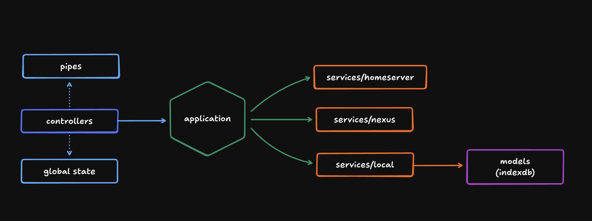

# Core architecture overview (src/core)

This document captures the intent, boundaries, responsibilities, and operating model of `src/core/`

> 

## Purpose and scope

Core is the _domain layer_ of the application. It is _UI-agnostic_ and provides a _stable API_ for the rest of the app

- The UI interacts only with controllers (user-initiated actions).
- Coordinators react to system events and call controllers (system-initiated actions).
- Controllers invoke pipes for normalization/validation, stores for state, and application workflows for business logic.
- Application orchestrates IO and business rules, and solely coordinates all service and model access. **Application is NOT an entry point**—it is called BY controllers.
- Service layers (local, homeserver, nexus) provide IO boundaries. Only local services may access models (Dexie).
- Pipes perform data transformation/validation only—no IO.
- Models are restricted to Dexie persistence with strict CRUD.
- The public API of core is exported via `index.ts`.

This layered design ensures strict separation of concerns, testability, and codebase resilience.

## Architectural flow (high-level)

**Entry Points (initiate workflows):**
1. _UI_ — User interacts with the app (clicks, form submissions)
2. _coordinators_ — System reacts to events (timers, auth changes, page visibility, routes, etc.)

**↓ Both call ↓**

3. _controllers_ — Translate intent into workflows
   1. Invoke _pipes_ for normalization and validation
   2. Perform global state mutations via _stores_ for UI visibility
   3. Call _application_ to orchestrate business logic
4. _application_ — Orchestrate business workflows (NOT an entry point, called BY controllers)
5. _services_ — Define IO boundaries
   1. _Nexus_ — Reads (bootstrap, streams, users, posts, tags, search, files)
   2. _Homeserver_ — Writes (user data, sessions, uploads)
   3. _local_ — Local persistence and cache management
6. _models_ — Dexie-based persistence layer (indexedDB)

## Layer responsibilities (global duties)

- _coordinators/_: System-initiated coordination that reacts to state changes (auth, visibility, routes) and triggers controller actions autonomously. Examples: polling for notifications, TTL sync, cache warming, scheduled cleanup, etc.
- _controllers/_: Entry point for user-initiated actions from the UI. Shape and guard requests; invoke pipes for normalization; call application for orchestration; mutate stores for UI state. No direct IO.
- _pipes/_: Normalize/validate inputs. Enforce `pubky-app-specs` to shield domain logic from external data shapes.
- _application/_: Orchestrate business workflows. **NOT an entry point**—called BY controllers. Sequence local and remote IO. Apply retries/backoff and invariants. Returns data to controllers.
- _services/_: IO boundaries.
  - _local_ handles persistence and cache integrity (Dexie).
  - _homeserver_ handles network sessions and PUT/DEL/GET operations.
  - _nexus_ handles read operations.
- _models/_: Typed, minimal Dexie-backed tables with consistent CRUD primitives
- _database/_: Dexie schema versioning and safe initialization/recovery. Also for migrations.
- _stores/_: Global state for UI. No business logic.
- _index.ts_: The canonical public surface of `@/core` by re-exporting submodules.

### Allowed dependencies (who may call whom)

- UI → controllers (user-initiated actions)
- coordinators → controllers (system-initiated actions)
- controllers → pipes, application, stores
- application → services (local, homeserver, nexus)
- **application → application** (same layer, for cross-domain orchestration, acyclic only, max depth 1)
- services
  - local → models
  - homeserver -> network only
  - nexus → network only
- models → Dexie only (no network, no stores). Encapsulated in its domain, cannot invoke other domains
- pipes → no IO; transform only

**Key Rule:** Application is called BY controllers, never calls them back. Unidirectional flow.

**⚠️ Enforcement Note:** Since our architecture uses static classes without dependency injection, the constraints on Application → Application calls (acyclic, max-depth-1) **cannot be enforced at compile time**. These rules are enforced through code reviews, documentation, and testing. See ADR-0009 for details.

### Anti-patterns to avoid

- Bypassing `application` orchestration by calling services directly from controllers.
- Services or application calling controllers (violates unidirectional flow).
- Coordinators calling application directly (must go through controllers).
- Application accessing stores directly (controllers handle store mutations).
- Performing IO in `pipes` or models.
- Encoding business logic inside services beyond minimal prerequisites.
- Returning external (un-normalized) shapes into controllers/UI.
- Duplicating stream logic across layers (keep in `PostStreamApplication` and local stream services).
- **Circular application dependencies** (Application A → B → A forbidden).
- **Deep application call chains** (max depth 1: if A calls B, B cannot call another Application).

## IO boundaries

IO boundaries are the seams where side effects occur. They are isolated to ensure testability, swapability, and fault tolerance.

### Inbound boundaries (entry points)

- **controllers** (called by UI): Accept user intent, perform validation via pipes, invoke application, update stores.
- **coordinators** (called by system): React to system events, call controllers to initiate workflows.

### Outbound boundaries (to the outside world)

- `services/homeserver`: Session/auth, HTTP requests for writes (PUT/POST/DELETE/GET), blob uploads, auth URL creation, signup token generation. Maps errors to domain errors.
- `services/nexus`: HTTP reads for bootstrap, streams, users, posts, tags, search, files. Encodes pagination and stop semantics.
- `services/local`: The exclusive interface to Dexie models. Manages multi-table consistency (counts, relationships, TTL), stream cache integrity, and local-first write operations with eventual consistency guarantees.

## Local-first consistency model

The write model is local-first, ensuring immediate responsiveness for the user.

Design implications:

- UI reflects local state immediately; eventual consistency with the homeserver and nexus.
- Reconciliation occurs via periodic retries or explicit repair flows.
- Rollback (compensation) is optional and applied only when strict consistency is required.

### Data model

Tables (representative; see code for full schemas and indexes):

- user\_\*: `user_details`, `user_counts`, `user_relationships`, `user_connections`, `user_tags`, `user_ttl`
- post\_\*: `post_details`, `post_counts`, `post_relationships`, `post_tags`, `post_ttl`
- streams: `post_streams` (IDs), `user_streams` (Pubky), `tag_streams` (hot tags)

Conventions:

- Composite IDs for posts: `author:postId` unify joins and references across the domain.
- TTL rows exist per entity domain to support expiry policies.
- Stream rows preserve order and are updated via dedicated stream models; integrity checks precede usage.

## Architecture Decision Records (ADRs)

ADRs are lightweight documents that capture key architectural decisions — think commit messages for architecture.
They preserve the why behind choices, guide future changes, and help new developers understand system rationale.

Each ADR includes:

- **Context** — Situation leading to the decision
- **Decision** — What was chosen and why
- **Consequences** — Impact and trade-offs
- **Alternatives** — Other options considered

Stored in `.cursor/adr/` for traceability and collaboration.

### Key ADRs

- _0001-local-first-writes_ — Local-first model for responsiveness
- _0002-composite-post-ids_ — Unified author:postId format
- _0003-streams-as-caches_ — Stream caching strategy
- _0004-layering-and-dependency-rules_ — Dependency and layering contracts
- _0005-ttl-refresh-policy_ — TTL cadence for users, posts, and tags
- _0006-pipes-normalization_ — Normalization/validation pipeline at the pipes layer
- _0007-dexie-version-normalization (TBD)_ — Consistent Dexie versioning
- _0008-coordinators-layer_ — Coordinators for system-initiated workflows
- _0009-application-cross-domain-orchestration_ — Application-to-Application calls for workflow orchestration
- _0010-notification-application-orchestration_ — NotificationApplication cross-domain entity aggregation privilege
